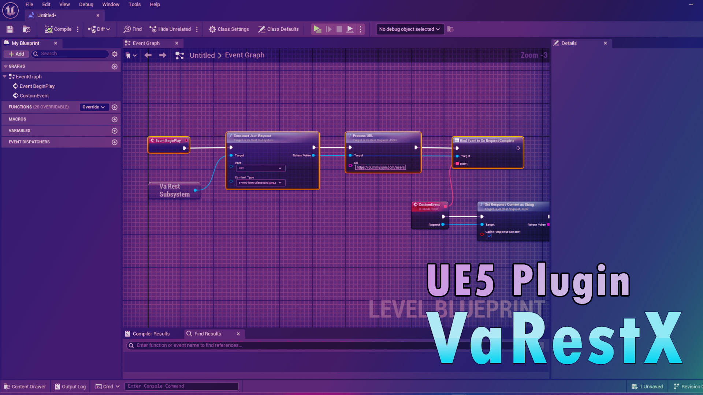

> [!IMPORTANT]
> This is a fork of the original VaRest from ufna which we loved and used widely in our projects, unfortuntaly the support has come to an end, and projects still use it over the http blueprint plugin provided by epic, which could be less advanced and curated than this, we have decided to fork this project and bring it back for Unreal Engine 5.5, however we ask the help of the entire community to keep it up to date and improve it with pull requests as we don't assure you any improvements or new features.
>
> Feel free to use the existing code as a foundation for your own projects.
# VaRestX

VaRestX is the plugin for [Unreal Engine 5](https://www.unrealengine.com/) that makes REST server communications easier to use.

Key features:

* Flexible Http/Https request management with support of different Verbs and Content Types
* **No C++ coding required**, everything can be managed via blueprints
* Blueprintable FJsonObject wrapper with almost full support of Json features: different types of values, **arrays**, **binary data** content, both ways serializarion to FString, etc.
* Blueprintable FJsonValue wrapper - **full Json features made for blueprints!**
* Both bindable events and **latent functions** are provided to control the asynchronous requests

Check the [Wiki](http://bit.ly/VaRest-Docs) for plugin usage examples and installation notes.

Legal info
----------

Unreal® is a trademark or registered trademark of Epic Games, Inc. in the United States of America and elsewhere.

Unreal® Engine, Copyright 1998 – 2021, Epic Games, Inc. All rights reserved.

